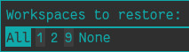

# Basic manager for i3-resurrect using Rofi

This a "GUI" interface for i3-resurrect, a manager, if you wish.
I created it have a menu to restore all of my workspaces (or just some of
them) whenever I want, mostly at startup.

While I quite like i3-resurrect, it doesn't have a way of restoring all
workspaces at once, so you have to write your own magic on top to do so.

You might also want to just restore one, or two, or specific workspaces rather
than all at once.

So I created this manager. For now it's fairly simple, it only allows
restoring workspaces (not saving, or restoring only the layout/programs).

It uses Rofi to provide a menu to choose workspaces from. It will use
`i3-resurrect ls workspaces` to fetch all the defined workspaces. Once it
does, it will display a Rofi menu leeting you pick between `All` to restore
every defined workspace; any of your defined workspaces individually; and
`None` to do nothing and exit.



If you start typing it will start filtering, courtesy of Rofi. You can just
select any of the options with the arrow keys and `Enter`.

**If you want to select a combination of workspaces to open**, you'd only need
to type them separated by spaces and hit `Enter`. For instance, `1 2` would
then restore workspaces `1` and `2`.

## Installation

This is mostly meant to be an Arch Linux package. So if you you use Arch,
Manjaro, or some other distro derived from Arch Linux, you only need to build
the package and then install it with `pacman`.

In any other distro it's gonna be manual, but thankfully the process is really
easy. Just make sure you have `i3wm`, `rofi` and `i3-resurrect`. Then copy
`i3-resurrect-manager` to `/usr/local/bin`. Then set executable permissions if
needed, and that should be it, at least currently.

If you're on Arch, or Manjaro, I really recommend you build the package and
then install it with Pacman. It will allow for easy removal. There's two ways
to go about it:

1. Docker image build: If you have Docker set up, you can simply execute the
`builder.sh` script, which will build a Docker image based on Arch Linux,
build this package, and then return you the package built into an `./outputs/`
directory. You then will need to install the package with `pacman`.

2. Manually in your system: You can simply build the package in your own
system. You'll need at least `base-devel` for this. `cd` into this directory,
and run:

```bash
makepkg --needed --syncdeps
# Once the package is built you can install it:
sudo pacman -U --needed *.pkg.tar.xz
```
